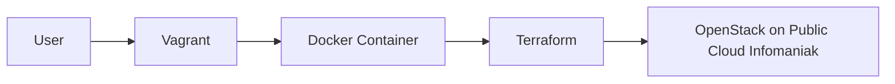

# Terraform Infrastructure Deployment with OpenStack on Infomaniak

This guide will help you set up a Terraform environment within a Docker container to deploy an infrastructure on the OpenStack cloud provided by Infomaniak.

## Prerequisites

- Install Vagrant, VirtualBox, Terraform, Docker, and OpenStack CLI.
- Download the OpenStack RC File.sh script from your Infomaniak project and source it before running the `terraform plan` command.


## Diagram



## Setup

1. Clone this repository to your local machine.
2. Create a `terraform.tfvars` file with the required variables.
3. Run `vagrant up` to start the Vagrant environment. This command will automatically build the Docker image and start the container.
4. SSH into the Vagrant environment using `vagrant ssh`.
5. In the SSH session, run the following commands:
   - Initialize Terraform: `terraform init`
   - Apply the Terraform configuration: `terraform apply`

## Interact with the OpenStack cloud

Interact with the OpenStack cloud using the OpenStack CLI or tools like openstackclient.

## Additional Commands

- Copy your public key to the container for SSH access:
  ```sh
  docker cp ~/.ssh/devomax_ssh_infomaniak.pub <idcontainer>:/root/
  ```

## Repository Structure

- `Vagrantfile`: Used for provisioning the Docker container.
- `Dockerfile`: Used for building the Docker image.
- `main.tf`: The main Terraform configuration file.
- `variables.tf`: Defines the required variables for the Terraform configuration.
- `terraform.tfvars.example`: An example file for the `terraform.tfvars` file.

## Contributing

For those who wish to contribute to the project:

1. Fork the repository.
2. Create a new branch from the `main` branch for your feature or bugfix.
3. Make your changes and commit them to your branch.
4. Push your branch to your forked repository.
5. Create a pull request against the `main` branch.

Please ensure your contributions adhere to the [Code of Conduct](CODE_OF_CONDUCT.md) and the [Contributing Guidelines](CONTRIBUTING.md).

## License

This project is licensed under the MIT License - see the [LICENSE.md](LICENSE.md) file for details.


This diagram illustrates the relationship between the user, Vagrant, Docker container, Terraform, and OpenStack.

Inspired by Xavki - https://gitlab.com/xavki/infrastructure-cloud-infomaniak
